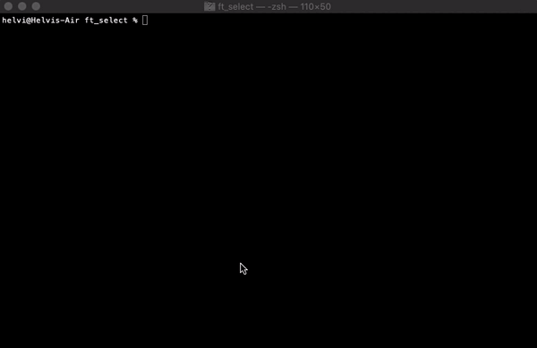
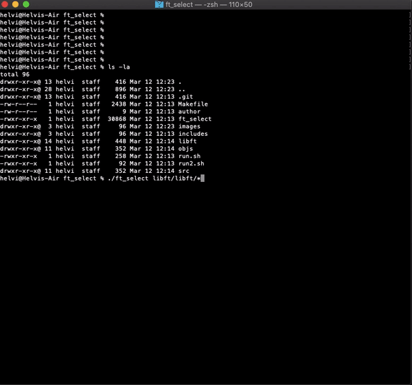
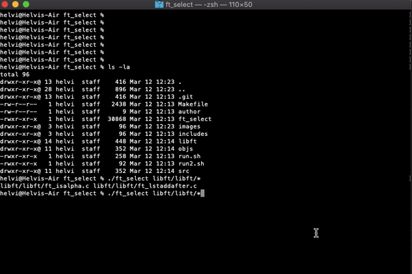

# ft_select

To run the project, download it and build with `make`.
The project needs curses.h and term.h and the libraries for
those. On debian you can install the dependencies with
`sudo apt install libncurses-dev libncurses6`

A program that creates a selection list using termcaps.

Read the full subject of this project [here.](ft_select.en.pdf)

The requirements of this project include the following:
  - The termcap library is mandatory in this program
  - ncurses library is forbidden
  - Only allowed ready made functions are
      - isatty, ttyname, ttyslot
      - ioctl
      - getenv
      - tcsetattr, tcgetattr
      - tgetent, getflag, tgetnum, tgetstr, tgoto, tputs
      - open, close, write
      - malloc, free
      - read, exit
      - signal
   - The program needs to start a canonical mode. The user can go
     through the list with arrows, select and unselect an option
     with space, delete options with backspace and delete, and
     return from the program with esc (nothing is written to the
     parent shell) or return (selected options are printed with a
     separating space)
     
     
User has to be able to run the command in subshell with backquotes
(command substitution) as shown in the following example with rm
command.

User has to be able to resize the window, also to a smaller size
than what the list actually needs.

The program must handle all the signals and in every case it has to
return in a controlled manner so that the usage of the calling shell
is restored. Also ctrl z should work perfectly.

